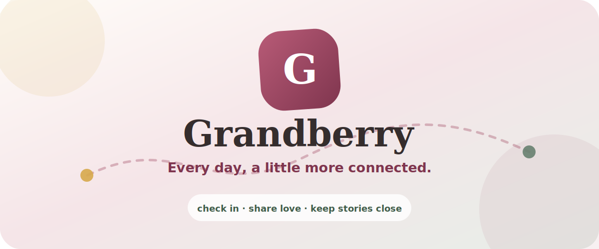
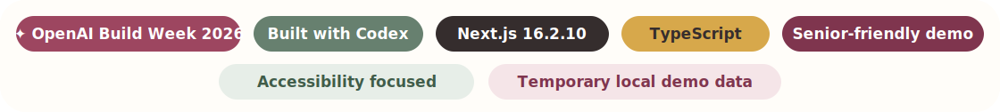
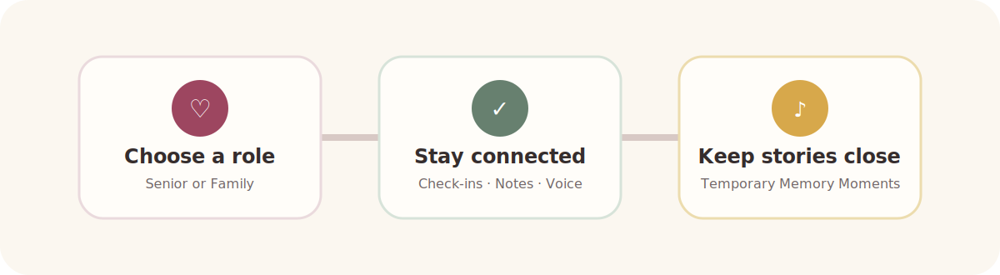
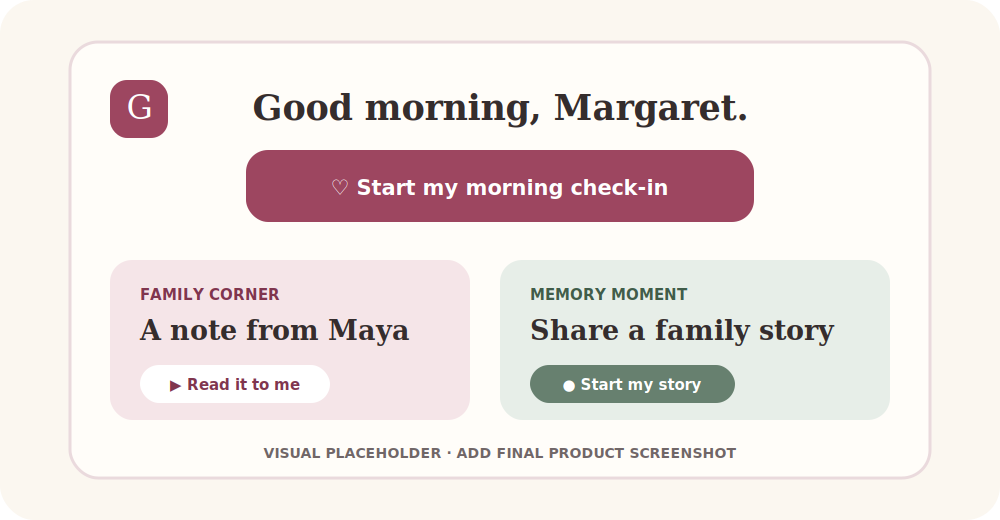
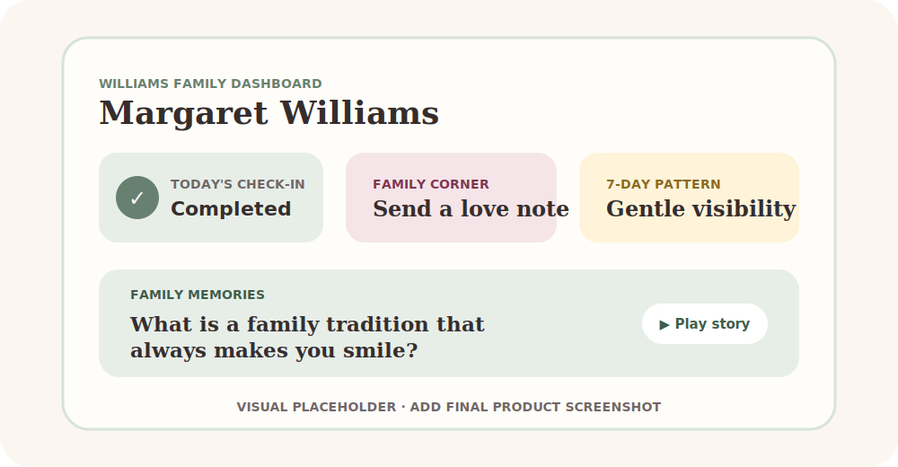

<div align="center">



# Grandberry

### Every day, a little more connected.

**A voice-first companion helping older adults check in, stay connected with family, and preserve meaningful memories.**



<br />

> **Grandberry turns small daily moments into reassuring family connection — without making medical claims.**

</div>

---

## 🌱 The problem

Older adults and their families often want to feel close without turning every interaction into a status check. A missed routine can create uncertainty, while precious family stories and everyday messages can disappear into busy schedules.

Grandberry explores a gentler question:

> **What if checking in felt less like reporting—and more like being cared for?**

---

## 🍓 The Grandberry solution

Grandberry connects one fictional demonstration household—the **Williams family**—through four calm, focused experiences:

| 🌤️ Daily routine | 👨‍👩‍👧 Family visibility | 💌 Everyday affection | 🎙️ Living memories |
|---|---|---|---|
| A six-question morning check-in | A clear family dashboard and seven-day pattern | Love notes, read-aloud support, and voice replies | Guided voice stories shared with family |

The prototype starts with a simple role choice: **Continue as Senior** or **Continue as Family**. No account setup is needed for the demo.

<div align="center">
  
</div>

---

## 👵 Senior experience

### A morning flow designed for clarity

- One decision per screen
- Six structured questions: **sleep, mood, physical comfort, water, first meal, and medication confirmation**
- Large answer targets, visible progress, Back and Next controls
- Optional typed detail for “Something else” under physical comfort
- Review, change-answer, completion, and start-again states

### Connection without complexity

- A large family note with **“Read it to me”** browser speech synthesis
- A short voice reply using the browser microphone
- Clear recording, playback, re-record, and send controls
- Permission-denied and unsupported-browser guidance

<div align="center">
  
  <br />
  <sub><strong>Screenshot placeholder:</strong> replace with a polished Senior-view capture before final submission.</sub>
</div>

---

## 🏡 Family experience

The family dashboard presents the fictional senior **Margaret Williams** with seeded demonstration information:

- Today’s status: **Completed, Not yet completed, or Missed**
- Six reported or confirmed check-in answers
- Completion time and last meaningful activity
- A seeded seven-day completion pattern
- A demo-only **“I’ll follow up”** action

### Silence is a Signal

When the seeded “Missed” state is selected, Grandberry offers a gentle reason to connect:

> Margaret has not completed today’s usual check-in. This may simply mean she is busy or away from the device. Consider sending a note or giving her a call.

It does **not** imply danger from a missed check-in.

### Family Corner

- Write a love note of up to 180 characters
- Preserve the note exactly as entered
- Show sender, time, confirmation, and message history
- Play a senior’s temporary voice reply in the family interface

<div align="center">
  
  <br />
  <sub><strong>Screenshot placeholder:</strong> replace with a polished Family-view capture before final submission.</sub>
</div>

---

## 🎙️ Memory Moment & Family Memories

Grandberry invites Margaret to answer one exact prompt:

> **What is a family tradition that always makes you smile?**

The senior can:

1. Start a voice story after explicitly granting microphone permission.
2. Follow a visible timer with a **90-second maximum**.
3. Stop, play, and record again.
4. Add the story to the temporary Williams family memory collection.

The family receives a listen-only **Family Memories** view with the prompt, speaker, timestamp, and audio player. A clearly labeled metadata-only **Demo example** contains no fabricated audio.

> [!IMPORTANT]
> Voice recordings use temporary browser object URLs. Grandberry does not upload, transcribe, analyze, or permanently save them. Refreshing or closing the page may remove them.

---

## ♿ Accessibility & inclusive design

Grandberry’s interface is intentionally warm, high-contrast, and low-friction:

- Large text and generous touch targets
- Semantic headings, fieldsets, labels, and progress information
- Visible keyboard focus states
- Text plus icons—never color alone for essential meaning
- Live status messages and alert roles for recording feedback
- Responsive layouts tested at approximately **390 × 844**
- Reduced-motion CSS support
- Browser speech synthesis for family notes
- Clear microphone permission and unsupported-browser messages

The goal is not merely a larger interface. It is a **calmer interaction model**.

---

## 🛡️ Safety & privacy boundaries

> **Grandberry supports family routines and connection. It does not provide medical advice, diagnosis, emergency monitoring, or guaranteed alerts.**

This prototype:

- Uses **fictional demonstration content** for Margaret Williams, Maya, and the Williams family
- Uses no production authentication or invitations
- Uses no database, cloud storage, analytics, or external messaging service
- Makes no medical interpretation from check-in answers or missed routines
- Requests microphone access only after the user presses a recording button
- Keeps love notes, voice replies, and memories in temporary in-memory demo state
- Does not transmit audio outside the local demo

---

## 🤖 How Codex and GPT-5.6 fit the build

Grandberry was developed through an iterative **Codex-assisted Build Week workflow**: milestone planning, scoped implementation, accessibility review, local verification, and intentional Git commits.

**Important runtime distinction:** the current application does **not** call the OpenAI API and does not include GPT-5.6, transcription, summarization, or model-generated health interpretations. Any future AI capability would require a separate, privacy-reviewed milestone.

Before publication, the project creator should confirm the exact model attribution used during the development workflow. No GPT-5.6 runtime badge is included because the repository does not prove that integration.

---

## 🧰 Technology stack

| Layer | Repository-proven technology |
|---|---|
| Framework | **Next.js 16.2.10** App Router |
| UI | **React 19.2.4** |
| Language | **TypeScript 5** |
| Styling | **Tailwind CSS 4** plus global CSS |
| Voice playback | Browser **SpeechSynthesis API** |
| Voice recording | Browser **MediaRecorder API** and temporary Blob URLs |
| State | React state and module-level in-memory stores |
| Quality | ESLint, TypeScript checking, production build, `git diff --check` |

No additional UI component library or backend SDK is installed.

---

## 🗺️ Application routes

| Route | Purpose |
|---|---|
| `/` | Role-selection landing page |
| `/senior` | Senior home, Family Corner, and Memory Moment |
| `/senior/check-in` | Six-step morning check-in |
| `/family` | Family dashboard, Family Corner, and Family Memories |

---

## 🚀 Quick start

### Requirements

- Node.js compatible with Next.js 16
- npm
- A modern browser; microphone features require browser support and permission

### Install and run

```bash
git clone <your-grandberry-repository-url>
cd <your-grandberry-folder>
npm install
npm run dev
```

Open [http://localhost:3000](http://localhost:3000).

### Verify the project

```bash
npm run lint
npx tsc --noEmit
npm run build
```

No environment variables or API keys are required for the current prototype.

---

## 🧑‍⚖️ Judge testing guide

For the clearest end-to-end demo, use a modern Chromium-based browser and navigate using Grandberry’s in-app links so temporary state remains available.

### 1. Senior morning check-in

1. Select **Continue as Senior**.
2. Press **Start my morning check-in**.
3. Complete all six questions.
4. Review and change one answer.
5. Finish the check-in.

### 2. Family visibility

1. Return through **Choose another role** and select **Continue as Family**.
2. Switch among Completed, Not yet completed, and Missed.
3. Review the seven-day pattern.
4. In Missed, read **Silence is a Signal** and press **I’ll follow up**.

### 3. Love note and voice reply

1. In Family Corner, send Margaret a love note.
2. Navigate in-app to Senior.
3. Read the note or use **Read it to me**.
4. Record, stop, play, re-record, and send a voice reply.
5. Navigate in-app to Family and play Margaret’s reply.

### 4. Memory Moment

1. On Senior, scroll to **Memory Moment**.
2. Press **Start my story** and grant microphone permission.
3. Record briefly, stop, play, then record again.
4. Press **Add to family memories**.
5. Navigate in-app to Family and play the Shared memory.
6. Confirm the **Demo example** remains labeled and has no fabricated audio.

> [!TIP]
> Refresh resets temporary demo state. This is expected behavior for the Build Week prototype.

---

## 🖼️ Screenshots & demo

| Senior experience | Family experience |
|---|---|
| Morning check-in, Family Corner, and Memory Moment | Dashboard states, connection history, and Family Memories |
| Replace `senior-preview.svg` with a final capture | Replace `family-preview.svg` with a final capture |

**Demo video:** _Add the final submission video link here._<br />
**Live prototype:** _Add the deployed application link here._

---

## 🧪 Current prototype limitations

- One seeded fictional household; no production accounts or invitations
- Check-in answers are local component state and do not populate the family dashboard
- Family dashboard wellness data is seeded demonstration data
- Notes, replies, and memories are temporary in-memory state
- Refreshing or closing may reset messages and audio
- No database, Supabase, authentication, notifications, analytics, or cloud storage
- No OpenAI API, GPT runtime feature, transcription, or AI interpretation
- No SMS, WhatsApp, email, or external messaging
- Browser voice capabilities vary; microphone permission is required for recording
- The 90-second auto-stop, deny flow, keyboard-only flow, 200% zoom, and screen-reader announcements should receive final manual verification before submission

---

## ✨ OpenAI Build Week 2026

Grandberry was created as an **OpenAI Build Week 2026** prototype around a simple idea: technology for everyday life can help families feel present without replacing human care or connection.

The build was delivered in five focused milestones:

1. Visual foundation and role selection
2. Accessible senior morning check-in
3. Family well-being dashboard
4. Love notes and voice replies
5. Voice Memory Moments and Family Memories

---

<div align="center">

## Love, close at hand. 💗

**Built for quieter mornings, warmer check-ins, and stories worth hearing again.**

<sub>Grandberry · A fictional demonstration household · Temporary local demo data · No medical or emergency monitoring</sub>

</div>
