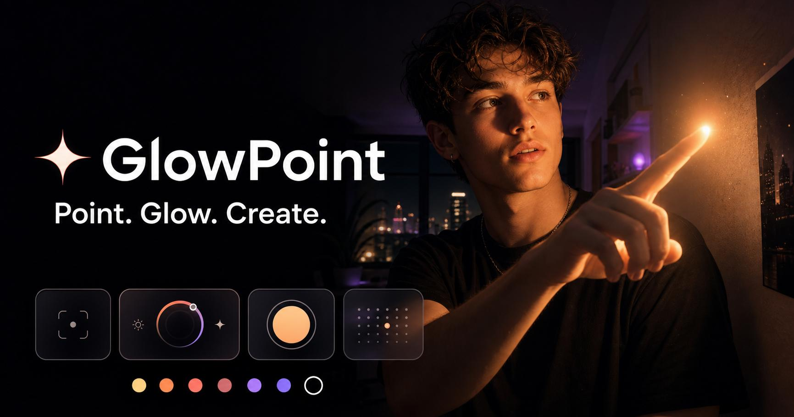

<div align="center">


[](https://git.io/typing-svg)

<p><strong>A cinematic camera playground that turns a pointing fingertip into a responsive virtual light.</strong></p>


[Live Demo](#-live-demo) · [Features](#-what-it-can-do) · [Quick Start](#-run-it-locally) · [How It Works](#-how-it-works)

</div>

---

## ✨ Meet GlowPoint

GlowPoint explores a tiny bit of sci-fi magic: what if pointing at something could light it up?

It wraps a live device-camera experience in a tactile, social-ready interface. Choose a color, shape the beam, tune the softness, and capture the moment—without sending the camera feed to a server. The current release is a polished interactive prototype with a camera-permission flow and a draggable fingertip-light simulation ready for a production hand-landmark model.



## 🔗 Live demo

> Deployment is being connected. The Vercel URL will appear here as soon as publishing completes.

## 💫 What it can do

| Experience | What it feels like |
|---|---|
| **Live camera mode** | Opens the front camera with a privacy-first permission flow. |
| **Fingertip glow** | A bright, layered light source with natural-looking bloom and falloff. |
| **Projected beam** | Toggle a soft directional beam and adjust its width and softness. |
| **Light lab** | Tune brightness, glow size, beam width, softness, and distance in real time. |
| **Color carousel** | Jump between warm, cool, yellow, blue, pink, purple, green, and red. |
| **Custom color** | Pick literally any glow color. Main-character lighting unlocked. |
| **Spotlight / Ambient** | Switch from a focused beam to a wide, dreamy wash. |
| **Capture moments** | Photo-flash feedback and short-video recording states. |
| **Safe fallback** | Camera-denied demo mode keeps every control explorable. |
| **One-tap reset** | Return the entire light setup to its original look. |

## 📸 Inside the app

<div align="center">
  
  <p><em>A warm fingertip light with believable face and wall illumination.</em></p>
</div>

## 🫶 How to use it

1. Open GlowPoint on a phone or webcam-enabled computer.
2. Tap **Use my camera** and allow camera access.
3. In prototype mode, drag the glowing point to preview smooth tracking.
4. Swipe through the color carousel or tap **＋** for a custom shade.
5. Use **Beam**, **Focus/Ambient**, and **Tune** to shape the lighting.
6. Tap the center shutter for a glow shot or the red control for a short clip.
7. Hit **↻** whenever you want the original setup back.

> Camera access requires HTTPS in production or `localhost` during development. GlowPoint does not upload the camera feed or automatically save captures.

## 🧠 How it works

```text
Device camera
     ↓
Local video preview
     ↓
Fingertip position → smoothed tracking point
     ↓
Glow core + bloom + directional beam + scene tint
     ↓
Interactive controls → final camera composition
```

The interface is a client-side React experience. `getUserMedia()` provides the live camera stream, while layered CSS lighting builds the luminous core, bloom, beam, face tint, falloff, and ambient modes. React state connects every color and light parameter to the rendered effect. No backend is required for the current prototype.

### Production computer-vision path

The next step is an on-device hand-landmark pipeline such as MediaPipe Hand Landmarker:

- Track the index-finger tip landmark in each camera frame.
- Infer pointing direction from the index MCP/PIP/DIP/tip landmark vector.
- Apply confidence gating when no hand or unclear pointing is detected.
- Smooth coordinates with a One Euro or Kalman filter to suppress jitter.
- Estimate scene depth and masks for more accurate surface-aware lighting.
- Composite photos and recorded frames through WebGL/WebGPU before local export.

## 🛠️ Built with

- **Next.js 16 App Router** for the application shell and production build
- **React 19** for interactive camera and lighting state
- **TypeScript** for predictable controls and browser-media APIs
- **Tailwind CSS 4 + custom CSS** for responsive glassmorphism and layered light
- **MediaDevices API** for local camera access
- **CSS blend modes, masks, gradients, filters, and animation** for the glow engine
- **Vercel** for HTTPS hosting and camera-safe delivery

## 🚀 Run it locally

```bash
git clone https://github.com/maherkhan-builds/grandberry.git
cd grandberry
npm install
npm run dev
```

Open [http://localhost:3000](http://localhost:3000), then allow camera access. For a production check:

```bash
npm run build
npm start
```

## 🔐 Privacy by design

- Camera processing stays in the browser whenever possible.
- The prototype does not upload camera frames.
- Nothing is saved unless the user explicitly chooses to save it.
- Denied camera access automatically falls back to an explorable demo.
- The experience is designed for future fully on-device landmark detection.

## 🗺️ Roadmap

- [ ] MediaPipe index-fingertip landmark tracking
- [ ] Confidence-aware hand and pointing messages
- [ ] One Euro filter for low-latency motion smoothing
- [ ] WebGL/WebGPU scene relighting and segmentation
- [ ] Local photo and MediaRecorder video export
- [ ] Rear-camera switch and mobile PWA install
- [ ] Accessibility and reduced-motion controls

## 🔎 Keywords

`computer vision` · `hand tracking` · `finger tracking` · `index fingertip detection` · `MediaPipe` · `camera app` · `real-time lighting` · `virtual light` · `augmented reality` · `AR camera` · `WebGL` · `WebGPU` · `Next.js` · `React` · `TypeScript` · `glassmorphism` · `Gen Z UI` · `creative technology` · `privacy-first` · `on-device AI` · `social camera` · `interactive lighting`

---

<div align="center">
  <h3>Built for the moment when your finger becomes the sun ☀️</h3>
  <p>If GlowPoint sparks an idea, drop the repo a ⭐</p>
</div>


